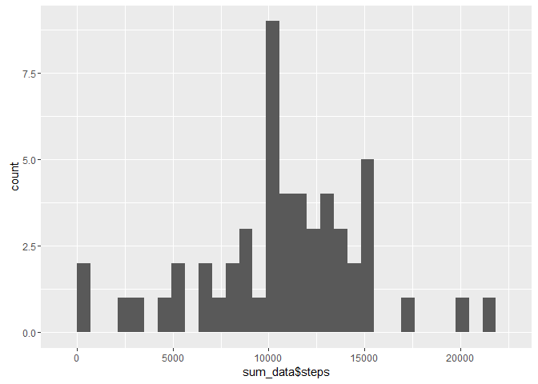
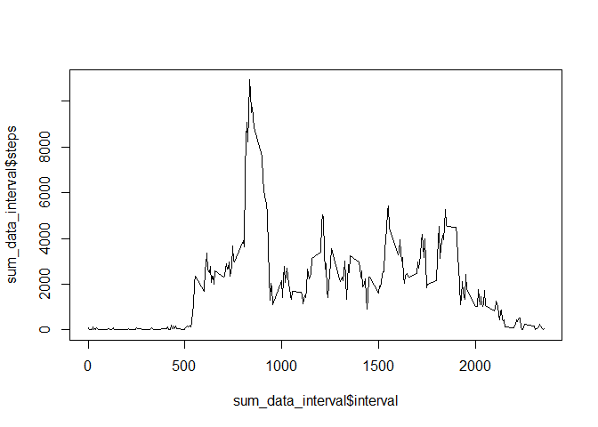
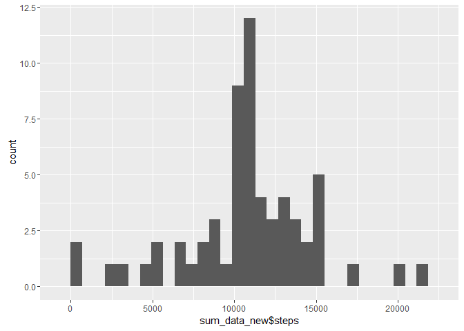
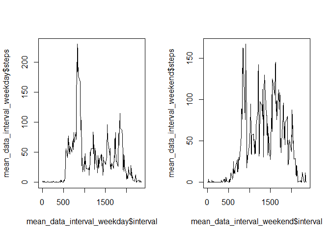

# Reproducible Research: Peer Assessment 1


```r
library(ggplot2)
```

## Loading and preprocessing the data

```r
unzip('activity.zip')
data = read.csv('activity.csv')
```


## What is mean total number of steps taken per day?

```r
sum_data = aggregate(steps ~ date, data, sum)
print(qplot(sum_data$steps))
```

```
## `stat_bin()` using `bins = 30`. Pick better value with `binwidth`.
```

 

```r
mean(sum_data$steps)
```

```
## [1] 10766.19
```

```r
median(sum_data$steps)
```

```
## [1] 10765
```


## What is the average daily activity pattern?

```r
sum_data_interval = aggregate(steps ~ interval, data, sum)
plot.ts(sum_data_interval$interval, sum_data_interval$steps, type = 'l')
```

 

```r
print(sum_data_interval$interval[which.max(sum_data_interval$steps)])
```

```
## [1] 835
```

## Imputing missing values

```r
nb_missing = sum(is.na(data$steps))
data_new = data
mean_data_interval = aggregate(steps ~ interval, data, mean)
index = match(mean_data_interval$interval, data_new[is.na(data$steps),]$interval)
data_new[is.na(data$steps),]$steps = mean_data_interval$steps[index]
sum_data_new = aggregate(steps ~ date, data_new, sum)
print(qplot(sum_data_new$steps))
```

```
## `stat_bin()` using `bins = 30`. Pick better value with `binwidth`.
```

 

```r
mean(sum_data_new$steps)
```

```
## [1] 10766.19
```

```r
median(sum_data_new$steps)
```

```
## [1] 10766.19
```

## Are there differences in activity patterns between weekdays and weekends?

```r
data_new$date <- as.Date(data_new$date)
weekdays_name <- c('Monday', 'Tuesday', 'Wednesday', 'Thursday', 'Friday')
data_new$day = c('weekend', 'weekday')[(weekdays(data_new$date) %in% weekdays_name)+1L]
par(mfrow=c(1,2))
mean_data_interval_weekday = aggregate(steps ~ interval, data_new[data_new$day == "weekday",], mean)
plot.ts(mean_data_interval_weekday$interval, mean_data_interval_weekday$steps, type = 'l')
mean_data_interval_weekend = aggregate(steps ~ interval, data_new[data_new$day == "weekend",], mean)
plot.ts(mean_data_interval_weekend$interval, mean_data_interval_weekend$steps, type = 'l')
```

 
